

    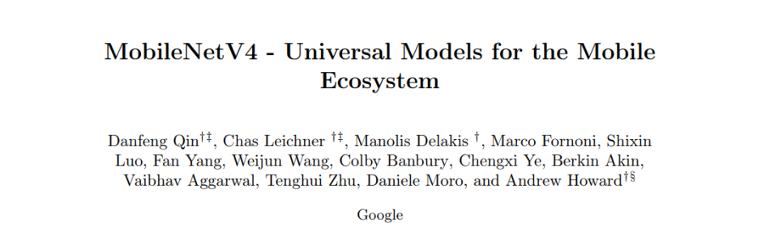

## MobileNetV4 - Universal Models for the Mobile Ecosystem
*Posted by JoonSeok Kim and DongGyu Kim*
- Qin, Danfeng and Leichner, Chas and Delakis, Manolis and Fornoni, Marco and Luo, Shixin and Yang, Fan and Wang, Weijun and Banbury, Colby and Ye, Chengxi and Akin, Berkin and others
- arXiv preprint arXiv:2404.1051

## Main Contributions
MobileNetV4 targets designing neural networks for mobile devices. Since the mobile platform can only offer limited compuation ability and DRAM utilization, software engineers are trying to design small and efficient neural networks. To use AI at the industry level, the inference latency must also be small. Main objectives of designing inference models for mobile devices are 
- Acceptable test performance on widely-used datasets such as ImageNet-1k
- Low inference latency for utilization in mobile devices
- Minimization of the number of parameters for low memory utilization on mobile platforms
- Minimization in the number of MACs for high enegy efficiency

This paper mainly focuses on lowering inference latency while maintining the test accuracy up to SOTA mobile neural net performance. Since it targets mobile platforms, it analyzes performance of various mobile hardwares, and designs a neural network to fit the harwares maximum performance. The designing process was done by the NAS technique, where the intantiation of UIB blocks were set as the search space. The main contributions of this work can be states as follows.

1. Universal Inverted Bottleneck (UIB) seach block - Unifies the Inverted Bottleneck (IB), ConvNext, Feed Forward Netowork (FFN), and Extra Depthwise variant
2. Mobile MQA - Attention block tailored for mobile accelerators
3. NAS technique to improve performance
4. Achieves Pareto optimal acorss various devices such as CPUs, DSPs, GPUs, and TPUs
5. Novel distillation technique to boost accuracy. Achieves 87% accuracy on ImageNet-1k and 39x smaller model size

## Preliminaries - Inverted Residual Blocks and Linear Bottlenecks

    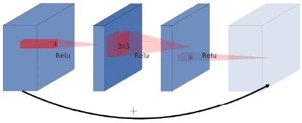

    

    Fig. 0 (a) Original Residual Block

Previously, the residual bottleneck block was propsoed, which consists of the 1x1 pointwise convolution in the first layer, a depthwise convolution in the second layer, and the final pointwise convolution layer, where its output is residually connected with the module's input. The first layer acts as a projection layer to generate the narrow, and parameter-efficient convolution layer for depthwise convolution. This part acts as the bottleneck layer. The output of this layer is expanded again in the pointwise convolution. Here, the module forms a wide-narrow-widw approach considering the number of channels.

    

    

    Fig. 0 (b) Inverted Residual Blocks 

However, in MobileNetV2, the authors use the inverted residual blocks with linear bottlenecks. In opposed to the original residual block where the first pointwise convolution acts as the projection layer and the final pointwise convolution acts as the expansion layer, the inverted residual block applied this in the opposite way to create the narrow-widw-narrow block. This assumes that the low-dimensional feature data is stored in the "narrow" layers, and these need to be expanded and extracted through the depthwise convolution. The required information in the narrow layers are passed onto the deeper layers through residual connections. Also, one has to take note that the final pointwise convolution layer in each inverted residual blocks do not have activations, in order to compensate the performnace degradation due to squeezing the layers where the skip connections are linked. 

## Preliminaries - Roofline Model and Hardware Efficiency
Algorithm running on hardware is composed of two parts - memory access and computation. The computation time is determined by the computation requirement and hardware performance. 

\text{runtime\_computation} = \frac{\text{Number of Operations}}{\text{FLOPS}}


Algorithm runtime can be limited by the memory access bottleneck or communication overhead


\text{runtime\_communication} = \frac{\text{Number of IO Bytes}}{\text{Bandwidth}}


Hardware performance is determined by the upper bound of the computation time or memory access latency


\text{performance} = \max(\text{runtime\_computation}, \text{runtime\_communication})


Below Fig. 1(a) and Fig. 1(b) illustrates the roofline model and its characteristics

    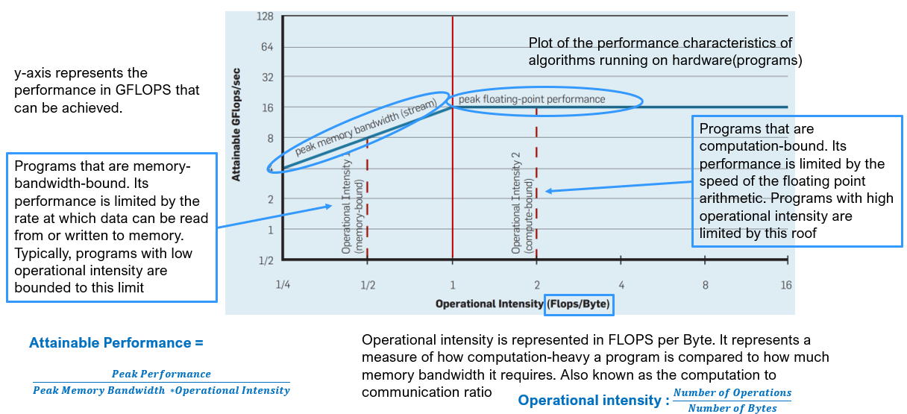

    

    Fig. 1 (a) Roofline Model

    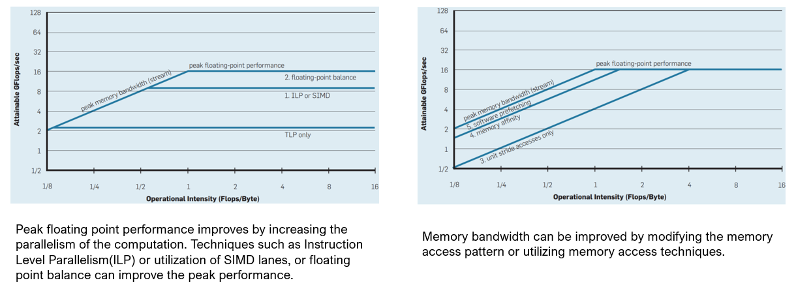

    

    Fig. 1 (b) Roofline Model with Ceiling

## Hardware-Independent Pareto Efficiency

    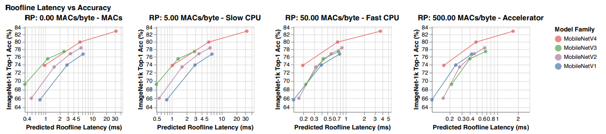

    

    Fig. 2. Ridge Points and Latency/Accuracy Tradeoffs

    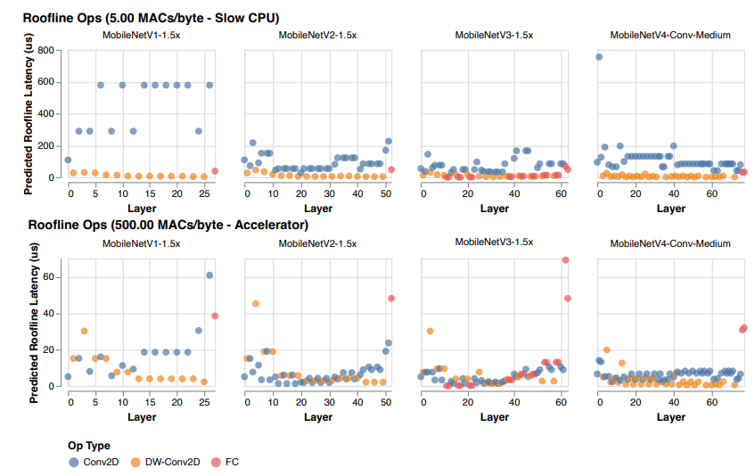

    

    Fig. 3. Op Cost vs. Ridge Point

This research focuses on efficiency on various hardware targets such as DSPs, CPUs, and GPUs. To find whether the hardware is limited by its memory bottlenecked or compute bottlenecked, the Roofline Model of that hardware must be investigated. It is defined by the harware's peak computational throughput and its peak memory bandwidth. The optima of that hardware can be found in its ridge point, which is defined by the hardware's ratio of Peak MACs to Peak memory bandwidth. The algorithm's accuracy and latency are swept by the ridge point on various hardware on Fig. 2, and Fig. 3. The roodline model of MobileNetV4 achieves highest Pareto-optimal performance compared to other MobileNet models. 

MobileNetV4 is designed to achieve Pareto optimal and hence balances MAC operations and memory bandwidth. The initial layers are designed with high MAC intensity, so as to improve model capacity and downstream accuracy. The end layers use identically-sized FC layers to maximize accuracy. These two initial and end layers are balances so that MobileNetV4 should not see slowdowns at any hardware. 

## Universal Inverted Bottlenecks (UIB)

    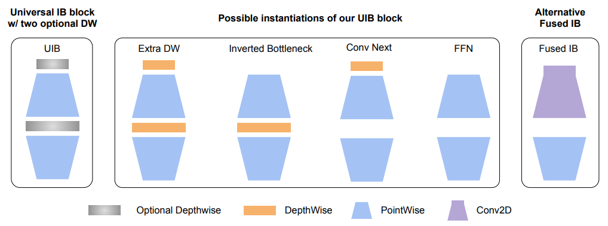

    

    Fig. 4. Universal Inverted Bottleneck (UIB) blocks

The main advantage of UIB is its adaptability and flexibility, that mitigates seach complexity. Optional Depthwise (DW) convolution blocks are inserted before the expansion layer, and between the expansion and projection layer. In the NAS procedure, common components such as the pointwise expansion and projection are shared and DWs are added as search options. UIB has four possible instantiations as follows.
- Inverted Bottleneck (IB) : Spatial mixing on the expanded features activations, and provides higher model capacity
- ConvNext : Cheaper spatial mixing before the expansion with larger kernel size
- ExtraDW : Inexpensive increase of the network depth and the receptive field. Combined benefits of ConvNext and IB
- FFN : Stack of two 1x1 pointwise convolutions. Accelerator-friendly operation

## Mobile MQA

    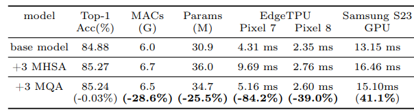

    

    Table 1. Efficiency Gains by MQA

This paper considers the Operational Intensity (OI), which is the ratio of arithmetic operations to memory access, to enhance efficiency of vision models on mobile accelerators. Here, Multi-Query Attention (MQA) is proposed instead od Multi-Head Self Attention (MHSA), which is simplified by utilization of shared keys and values across all heads. This sharing of keys and values reduces memory access hence improving OI, especially when the batch size is small. Large language models does not have significant accuracy drop in this MQA case. Table 1 shows that by adding MHSA and MQA, the performace accuracy has increased whereas the inference latency for MQA is approximately x39 lower than that of MHSA. Hence, MQA can accelerate better in the mobile environment, with negligible performance degradation. 

The Spatial Reduction Attention (SRA) is applied, hence incorporating asymmetric spatial down-sampling, to downscale keys and values, and not queries. In hybrid models, there is a certain correlation between spatially adjacent tokens, hence necessitating spatial mixing convolution filters.

## Refined NAS for Enhanced Architectures
As shown above, the insitantiation of UIB blocks are in the neural architecture search process. TuNAS was adopted for the paper's search strategy. The paper uses a two-stage search operation, the coarse-grained search and fine-grained serach to address the variance in parameter counts between UIB's depthwise layers and other search options. The course-grained search process involves determining optimal filter sizes with fixed parameters. The fine-grained stage searches for the UIB's layer configuration. 

## Results - Comparisons with Other Works

    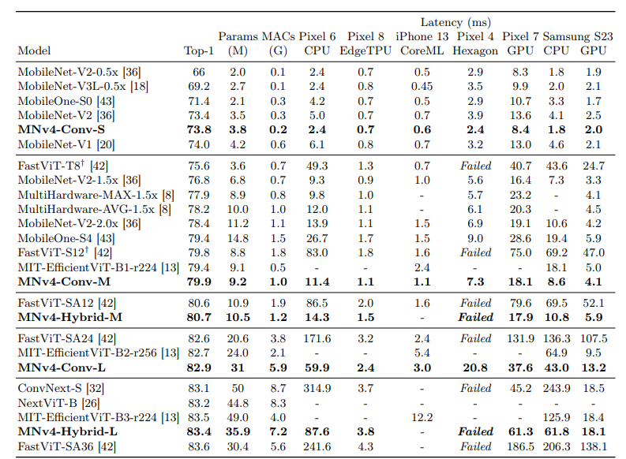

    

    Table 5. Classification results on ImageNet-1k

    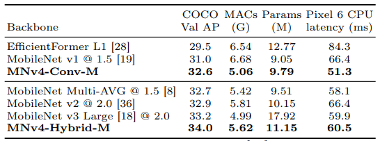

    

    Table 6. Object Detection results on the COCO validation set

Results on the classification performance on ImageNet-1k dataset show that the MobileNetV4 achieves the highest performance and smallest latency compareed to other models on various mobile platforms such as CPUs and DSPs of mobile phones. While other models have closely competitive latency with the MobileNetV4 model, their latency is much higher. 

The effectiveness of MobileNetV4 as backbone networks are tested on the COCO object detection experiment. The number of MACs were set to be similiar, and the Retina framework was used as the object detector. As the same as classification, MobileNetV4 achieves highest performance compared to other mobile-target modles, with the lowest CPU latency. Hence, the ability of MobileNetV4 for mobile devices can be shown. 

## Conclusion

- This paper proposes the MobileNet V4 series, a universal high-efficiency model that operates efficiently across a wide range of mobile environments.
- By introducing a new Universal Inverted Bottleneck and Mobile MQA layer and applying an enhanced NAS recipe, MobileNet V4 achieves near Pareto-optimal performance on various hardware, including mobile CPUs, GPUs, DSPs, and dedicated accelerators.
- Additionally, using the latest distillation techniques, it demonstrates cutting-edge performance in mobile computer vision by achieving 87% ImageNet-1K accuracy with a latency of 3.8ms on the Pixel 8 EdgeTPU.
- The paper also presents a theoretical framework and analysis for understanding the model's universality across heterogeneous devices, providing guidance for future design.

## Perspectives, Discussions and Future Research Directions

MobileNetV4 was designed with a focus on optimizing hardware performance, particularly for mobile devices such as mobile CPUs, GPUs, and DSPs. It leveraged Neural Architecture Search (NAS) to design its Unit Inverted Bottleneck (UIB) blocks and employed distillation techniques to enhance performance. Additionally, MobileNetV4 used MQA to incorporate transformer-like operations, further boosting its performance. The authors aimed to integrate as many state-of-the-art techniques as possible to optimize the neural network's performance in mobile environments. Given its recent development, MobileNetV4 is likely the state-of-the-art convolution-based neural network for mobile platforms.

The novelty of this work appears to be the neural architecture search involving the UIB, which includes the expansion and projection blocks with inverted residuals previously introduced in MobileNetV2. Since the performance is validated across various mobile platforms, MobileNetV4 presents an attractive solution for industry applications in mobile systems. However, the paper seems to combine existing methods, techniques, and modules into one comprehensive experiment to produce the optimal MobileNet model. The optimization was conducted logically and practically, but it would have been helpful if the authors had provided an analysis of the finalized MobileNetV4, explaining why NAS designed the UIB in that specific way and how features are extracted at each layer.

It is worth noting that many academic labs are currently designing mobile-level transformers like MobileViT or FastViT. This paper shows that these transformer-based models have similar performance to MobileNetV4 but with significantly higher inference latency. Although the parameter counts and the number of MAC operations are comparable, the latency difference raises questions about the practicality of developing mobile-level transformers for vision tasks. Despite incorporating MQA blocks, it appears beneficial to use bottleneck modules as the primary feature extractors.

Beyond MobileNetV4, many CNNs are integrating multi-head attention layers, while transformers are incorporating convolutions. Convolutions capture local feature relationships, whereas attention modules provide global features in computer vision. Combining these two characteristics enhances neural network performance across the board. In the future, it would be practical to design NPUs and domain-specific accelerators that enable fast and efficient computation for both convolutions and attention mechanisms simultaneously.

## Similar Works - MobileFormer

    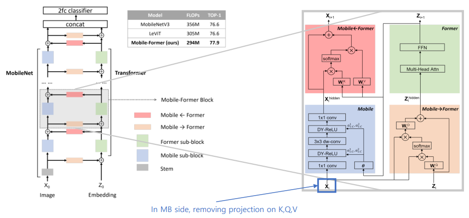

    

    Fig. 5. MobileFormer Network

    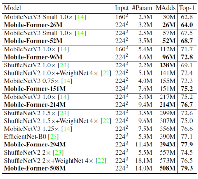

    

    Table. 7. Performance comparison of MobileFormer with other works

## References
[1] MobileNetV4 Implementation: [[Link](https://github.com/scalable-model-editing/unified-model-editing).](https://github.com/jiaowoguanren0615/MobileNetV4/tree/main)

[2] Qin, Danfeng, et al. "MobileNetV4-Universal Models for the Mobile Ecosystem." arXiv preprint arXiv:2404.10518 (2024).

[3] Sandler, Mark, et al. "Mobilenetv2: Inverted residuals and linear bottlenecks." Proceedings of the IEEE conference on computer vision and pattern recognition. 2018.

[4] Chen, Yinpeng, et al. "Mobile-former: Bridging mobilenet and transformer." Proceedings of the IEEE/CVF conference on computer vision and pattern recognition. 2022.
