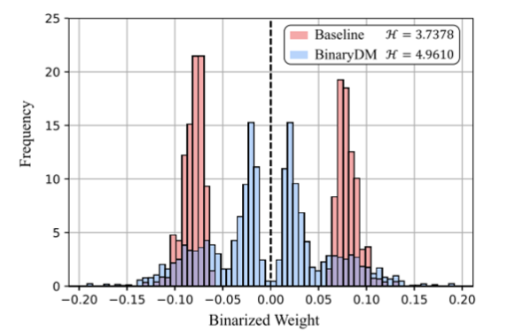
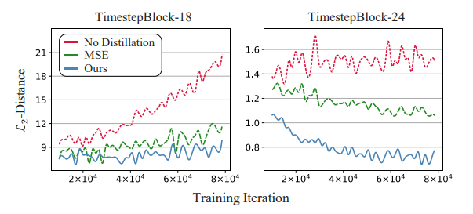
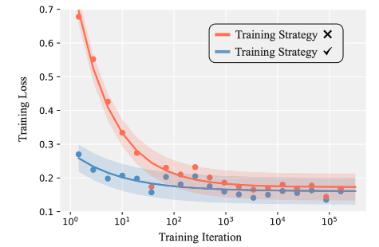
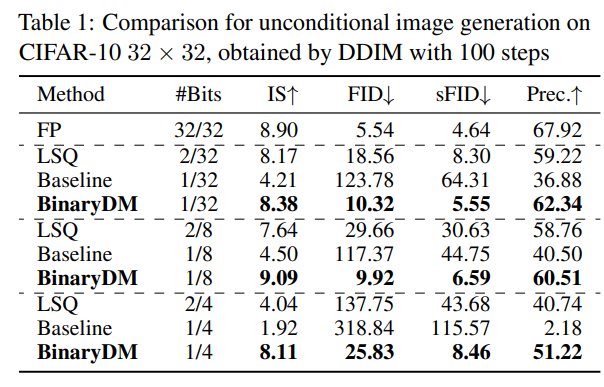
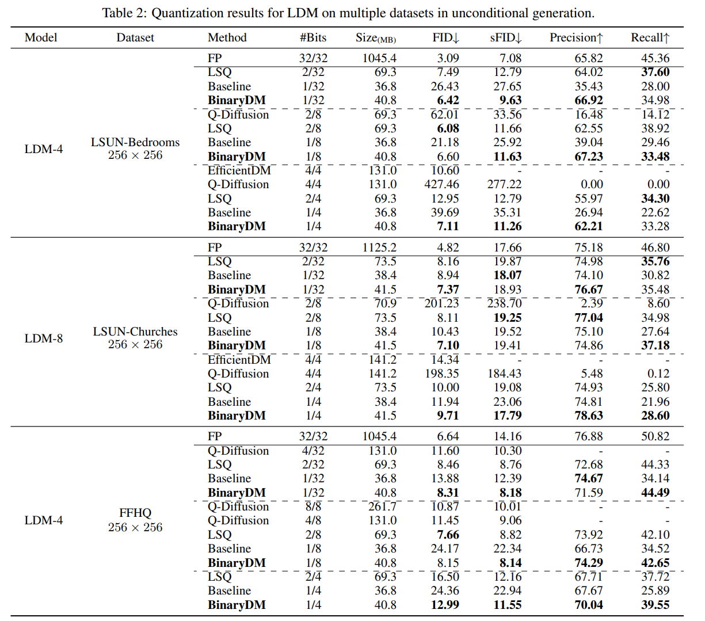
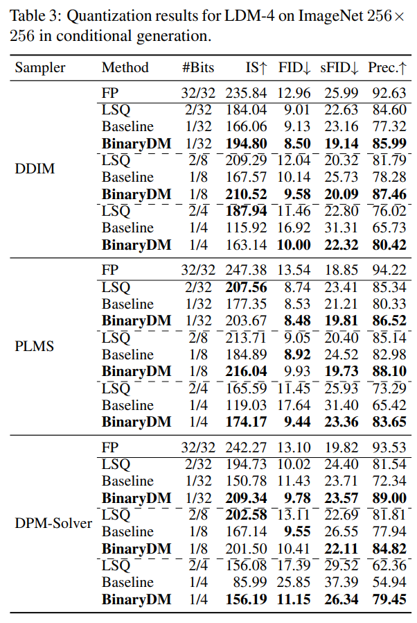
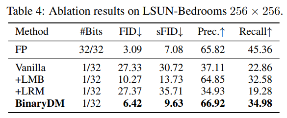
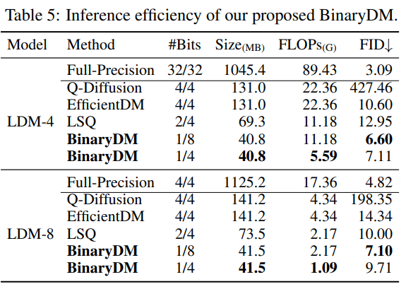
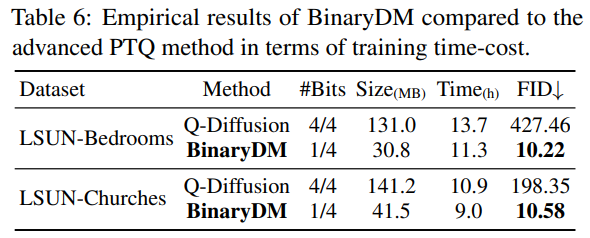

# BinaryDM: Towards Accurate Binarization of Diffusion Model

*Authors: Xingyu Zheng, Haotaong Qin, Xudong Ma, Mingyuan Zhang, Haojie Hao, Jiakai Wang, Zixiang Zhao, Jinyang Guo, Xianglong Liu*  
*Posted by Junhyuk So, Juncheol Shin*

## **Preliminary**
### **Diffusion**

   

  Diffusion model

Diffusion models learn how to remove gaussian noise added to original image. 
Equation below shows how forward process proceeds. During the forward process, Gaussian noise is gradually added to original image for T times. Strength of the noise is controlled by the term \beta. x_t denotes corrupted image at time step t.  
In the reverse process, diffusion model tries to restore original image by estimating conditional distribution q(x_{t} | x_{t-1}) with p_\theta(x_{t-1} | x_{t}). Reparameterization trick is used to estimate mean and variance of gaussian the distribution  

  
    q(x_{t} | x_{t-1}) = \mathcal{N}(x_t;\sqrt{1-\beta_t}x_{t-1}, \beta_{t}I) \\p_\theta(x_{t-1} | x_{t}) = \mathcal{N}(x_{t-1}; \tilde{\mu}_\theta(x_t, t) , \tilde{\beta}_{t}I )
   

### **Quantization**  

   

  Quantization example

Quantization is an optimization technique which restricts data(weights, activations) in low precision. Not only does it reduce the memory footprint, but it also enables accelerated computations given hardware support to low-precision arithmetic.  

Values are represented as follows when linear symmetric quantization is applied:

  
    q(x) = clamp(\lfloor \frac{x}{\Delta},-2^{b-1}, 2^{b-1}-1) \rceil,\ \ \Delta = \frac{\alpha}{2^{b-1}-1} 
   

x is value to be quantized and \alpha denotes trunctaion range. b denotes bit-width. \Delta is step-size, interval between quantization levels.
Binarization is extreme case of quantization, which only utilizes 1 bit (b = 1).

## **Motivation** 
While diffusion models achieved great success in generation tasks, its iterative nature act as a bottleneck to real-world application. Data must processed through heavy diffusion models for multiple steps and requires huge latency and memory footprint.

Quantization is one reasonable choice for the optimization of diffusion models. Especially when binarization is applied to weight, floating point operations can be substituted with cheap addition and memory footprint of the model can be reduced greatly. 

However binary models are hard to binarize in two aspects. One arises from perspective of representation, as binarization is extreme case of quantization which only uses 1bit to represent data. Naive binarization introduces severe degredation in quality of output. Another aspect arises from perspective of optimization. Training becomes unstable with binarized representation and hinders convergence of the model.

This work tackles binarization of diffusion models by handling aformentioned two aspects. By introducing *Learnable Multi-basis Binarizer(LMB)* and *Low-rank representation mimicking(LRM)*, BinaryDM is able to achieve **16.0× and 27.1× reductions on FLOPs and size**.  

## **Methodology**
### **Learnable Multi-basis binarizer**
Typical binarization of the weight can be described as follows:  

  
    w^{bi} = \sigma sign(w) = \left\{\begin{matrix}
 \sigma, & if w\geq 0 \\ 
 -\sigma, & otherwise 
\end{matrix}\right.
   

In this work, authors propose a learnable multi-basis binarizer(LMB) to maintain quality of representations. Instead of using single base, multiple bases are utilized for the binarization. \sigma_{\MakeUppercase{\romannumeral1}} and \sigma_{\MakeUppercase{\romannumeral2}} denote learnable scalar values and initialized as \sigma_{\MakeUppercase{\romannumeral1}}^0 = \frac{\left \| w  \right \|}{n} and \sigma_{\MakeUppercase{\romannumeral2}}^0 = \frac{\left \| w - \sigma_{\MakeUppercase{\romannumeral1}}sign(w)  \right \|}{n} 

  
    w_{LMB}^{bi} = \sigma_{\MakeUppercase{\romannumeral1}} sign(w) + \sigma_{\MakeUppercase{\romannumeral2}} sign(w - \sigma_{\MakeUppercase{\romannumeral1}} sign(w) 
   

  
Gradient of learnable scalar values can be computed as follows:  

  
    \frac{\partial w_{LMB}^{bi}}{\partial \sigma_{\MakeUppercase{\romannumeral1}}} = \left\{\begin{matrix}
 sign(w)(1-\sigma_{\MakeUppercase{\romannumeral2}} sign(w))), & if \ \sigma_{\MakeUppercase{\romannumeral1}}sign(w) \in (w-1, w+1)  \\ 
 sign(w), & otherwise 
\end{matrix}\right. 
   

  

During the inference, computation for each bases are indepedent to each other and can be parallely computed. Thus, diffusion model can be fully accelerated with LMB.  

It is important to note that LMB is applied at only crucial parts of difusion model. Only modules where features cale is greater than or equal to \frac{1} {2} input scale. In other words, some of the first consecutive layers and last consecutive layers are binarized with LMB. The binarized modules close to input or output play important role, as they extract patterns from original data or directly influence the final result.  Figure below shows result of naive binarization and LMB applied to weights.  

   

  Weight quantizatio result of naive binarization and LMB

### **Low-rank representation mimicking**
Binarization of weights makes the training hard and hiders convergence. Since full precision model is available, it is natural to align intermediate representations of binarized diffusion model and original model as additional supervision. However, fine-grained alignment of high-dimensional representation leads to blurry optimization direction and binarization makes the model hard to mimic full precision model.   

Authors propose Low-rank Representation Mimicking(LRM) to handle these problems. LRM utilize principal component analysis(PCA) to project representations to low-rank space. Then representaiton aligning is done in low-rank space by minimizing mean squared error (MSE)  

First, covariance matrix of i-th module C_i is computed with representation of full-precision diffusion model, \hat{\epsilon}_{\theta_{i}}^{FP}(x_t, t) \in \mathbb{R}^{h\times w\times c} . Then eigenvector matrix E_i can be obtained and first \lfloor\frac{c}{k}\rceil column eighenvectors are used to compute projected representations, \mathcal{R}_i^{FP} and \mathcal{R}_i^{bi}.  

  
    C_{i} = \frac{1}{{(h \times w)}^2}\hat{\epsilon}_{\theta_{i}}^{FP}(x_t, t) \hat{\epsilon}_{\theta_{i}}^{FP^T}(x_t, t), \\
    E_{i}^{T}C_{i}E_{i} = \Lambda_{i}, \\
    \mathcal{R}_i^{FP}(x_t, t) = E_{i}^{\lfloor \frac{c}{K}\rceil}\hat{\epsilon}_{\theta_{i}}^{FP}(x_t, t), \\
    \mathcal{R}_i^{bi}(x_t, t) = E_{i}^{\lfloor \frac{c}{K}\rceil}\hat{\epsilon}_{\theta_{i}^{bi}}^{bi}(x_t, t)
   

  
LRM loss and total loss can be expressed as follows:  

  
    {\mathcal{L}_{LRM}}_{i} = \left\| \mathcal{R}_i^{FP} - \mathcal{R}_{i}^{bi}  \right\| \\
    \mathcal{L}_{total} = \mathcal{L}_{simple} + \lambda\frac{1}{M}\sum_{i=1}^{M}{\mathcal{L}_{LRM}}_{i},
   

  
where M denotes the number of timestep embedding modules and \lambda is a hyperparmater coefficient to balance loss temrs.

Since computation of transformation matrix E_i is expensive, it is computed with the first batch of input and fixed during entire traning. As shown in the figure below, LRM stabilizes training process, accelerating convergence.  

   

### **Progressive binarization**
Despite the enhanced methodology, training process remains slow and unstable. To further stabilize convergence, authors additionally apply progressive binarization strategy. \lfloor \frac{M}{2} \rfloor-th time stepping module is quantized in first iteration and \lfloor \frac{M}{2} \rfloor - i-th and \lfloor \frac{M}{2} \rfloor + i-th modules are quantized in next i-th iteration. As show in the figure, benefit coming from progressive binarization is significant compared to baseline traning process.  

   

## Experiments
### Generation Performance
To demonstrate the performance of the binarized diffusion model, the author conducted experiments on two major categories of diffusion models: unconditional and conditional models. The metrics used to measure performance included FID and sFID for assessing the perceptual quality of images, IS for measuring diversity, and Recall and Precision for evaluating accuracy.
Additionally, for experiments with baselines, the methods used were LSQ for multi-bit cases and a QAT method similar to STE for single-bit cases.
Unconditional Generation  

In this experiments, authors utilized two types of models: the Pixel Space Diffusion Model, which performs generation directly in the pixel space, and the Latent Diffusion Model, which conducts generation in the latent space of a VAE.  

   

Table 1 shows the results of experiments conducted with the Pixel Space Model on the CIFAR-10 dataset, using a DDIM sampler with 100 steps. As can be seen in the table, the proposed method outperforms the baseline binarization method across all metrics. Additionally, it also yields better results than LSQ, which uses one more bit, across all metrics.  

   

Table 2 presents the results of experiments conducted with the same sampling strategy (DDIM 100) in the Latent Diffusion Model (LDM). As shown in the table, BinaryDM also outperforms the baseline across all metrics. However, unlike in Table 1, there are a few cases where LSQ with 2 bits shows better performance.  

   

Finally, Table 3 shows the experimental results for Conditional Generation. The dataset used was ImageNet 256. In this experiment, two unusual trends were observed: 1. The performance gap between the baseline and BinaryDM is very small, and 2. Lower FID scores than FP were observed in all quantization experiments. However, I personally believe that achieving better performance than FP in all situations, despite using 1-2 bit quantization, is not a reasonable result, suggesting that the experiment may have been conducted incorrectly.  

### Ablation Study
Three ablation studies were conducted. The first ablation study focused on the various methods of Binary DM, measuring performance changes with the addition of LMB and LRM. The second study evaluated inference efficiency by measuring the FLOPs required during the inference of the binarized DM. The third study examined training efficiency, comparing the training time of the proposed method to that of another diffusion quantization method, Q-Diffusion.

   

As seen in Table 4, when using the BinaryDM methods LMB and LRM independently, the performance improvement is not significant, but when used together, their effect is maximized.

   

Secondly, when measuring FLOPs, it was found that despite having a lower FID compared to multi-bit quantization schemes like Q-Diffusion or LSQ, the FLOPs are 2 to 4 times lower.

   

Lastly, when comparing the training time cost with Q-Diffusion, it was found that the training cost is approximately 1.2 times lower.

## Conclusion
BinaryDM is a paper on binary quantization of diffusion models, which achieves dramatic performance improvements by introducing two methods, LMB and LRM, instead of traditional quantization methods. LMB increases the representation quality of binary quantization by using two scaling factors instead of one baseline factor. LRM minimizes the loss of low-frequency components information in the quantized model by performing feature matching in a low-rank space. Furthermore, the progressive quantization proposed in the paper prevents significant information loss in the early iterations, minimizing performance degradation. Extensive experiments demonstrate the superiority of BinaryDM across various tasks.
