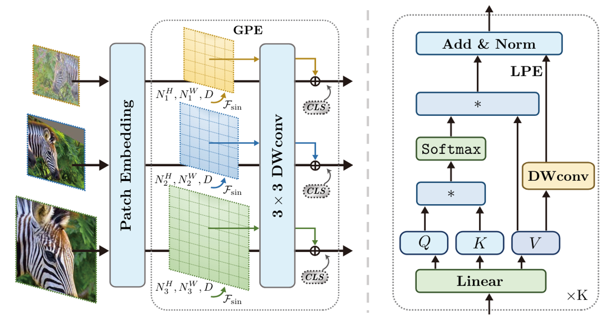
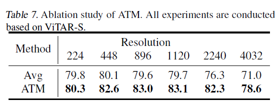
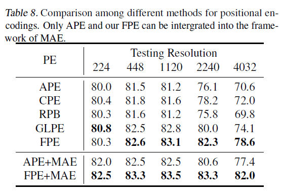
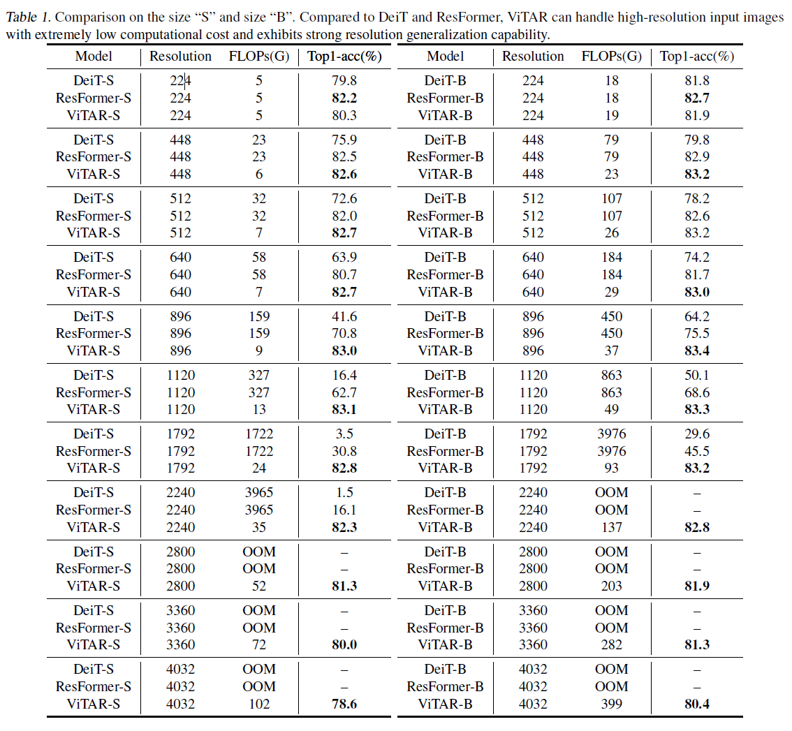
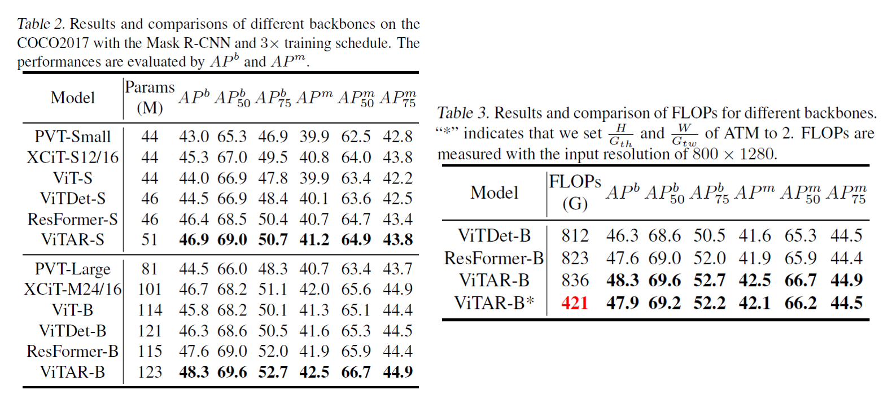

# **ViTAR: Vision Transformer with Any Resolution**
*Authors: Qihang Fan, Quanzeng You, Xiaotian Han, Yongfei Liu, Yunzhe Tao, Huaibo Huang, Ran He, Hongxia Yang*

## Vision Transformers (ViTs)

Vision Transformers (ViT) has recently emerged as a competitive alternative to Convolutional Neural Networks (CNNs) that are currently state-of-the-art in different image recognition computer vision tasks.

   

Vision Transformers (ViT) is an architecture that utilizes self-attention mechanisms to process images. The Vision Transformer Architecture consists of a series of transformer blocks. Each transformer block consists of two sub-layers: a multi-head self-attention layer and a feed-forward layer.

The self-attention layer calculates attention weights for each pixel in the image based on its relationship with all other pixels, while the feed-forward layer applies a non-linear transformation to the output of the self-attention layer. The multi-head attention extends this mechanism by allowing the model to attend to different parts of the input sequence simultaneously.

ViT consists of the following steps.
  1. Split an image into patches (fixed sizes)   
  2. Flatten the image patches 
  3. Create lower-dimensional linear embeddings from these flattened image patches   
  4. Include positional embeddings   
  5. Feed the sequence as an input to a state-of-the-art transformer encoder   
  6. Pre-train the ViT model with image labels, which is then fully supervised on a big dataset.
  7. Fine-tune the downstream dataset for image classification 

The transformer's encoder has a structure in which L transformer blocks sequentially pass through the Feed Forward, which consists of the Normalization Layer, Multi-head Attention, Normalization Layer, and MLP, as shown on the right of Figure 1.

## Challenge: Multi-Resolution ViT Modeling
 Shortcoming of ViT is revealed when receiving multi-resolution images as input. There are limits to its application in actual use environments because ViT cannot process images of various resolutions well.
 
 The most common method used to address this problem is to apply interpolation to positional encoding before feeding it into the ViT. This approach allows for some compensation of positional information even when the input resolution changes. However, this method has shown significant performance degradation in image classification tasks.
 
 Recently, ResFormer proposed adding depth-wise convolution to the existing positional encoding method when performing global-local positional embedding, enabling it to work well even with unseen resolutions. (Chu et al., 2023; Tian et al., 2023).

   

 However, ResFormer has three drawbacks.
 - Shows high performance only in a relatively small range of resolutions (Degradation significantly when resolution is greater than 892)
 - It cannot be used with self-supervised learning methods like masked auto-encoding (MAE).
 - Computation cost increases as input resolution increases, which has a negative impact on the training and inference process.

## ViTAR: Vision Transformer with Any Resolution

   

In this section, we introduces two key innovations to address this issue. Firstly, we propose a novel module for dynamic resolution adjustment, designed with a single Transformer block, specifically to achieve highly efficient incremental token integration. Secondly, we introduce fuzzy positional encoding in the Vision Transformer to provide consistent positional awareness across multiple resolutions, thereby preventing overfitting to any single training resolution.

### 1. Adaptive Token Merger (ATM Module)

   

    

    
Adaptive Token Merger (ATM) module is designed to efficiently process and merge tokens of different resolutions in a neural network using a simple structure that includes GridAttention and FeedForward network (FFN). ATM Module takes tokens $\(H\times W\)$ processed through patch embedding as input. ATM Module specially processes the inputs of different resolutions M times to reduce them to the same preset size $G_{h} \times G_{w}$ before fed into the MHSA.

   

     
The detailed process for ATM is as follows: 
 First, ATM divides the tokens of shape $H \times W $ into a grid of size $G_{th} \times G_{tw}$. 
 
 For simplicity, we'll use above Figure as an example. 
 In the figure, we can see $H=4$, $W=4$, $G_{th}=2$, and $G_{tw}=2$.(We assume that H is divisible by $G_{th}$ and W is divisible by $G_{tw})$. The number of tokens in each grid would then be $H/G_{th} × W/G_{tw}$, which is 2x2.

 Within each grid, the module performs a special operation called Grid Attention.

 #### GridAttention
For a specific grid, we suppose its tokens are denoted as $\{x_{ij}\}$, where $0 ≤ i < H/G_{th}$ and $0 ≤ j < W/G_{tw}$. 

Average Pooling: First, it averages the tokens within a grid to create a mean token.
Cross-Attention: Using this mean token as the Query, and all the grid tokens as Key and Value, it applies cross-attention to merge all tokens in the grid into a single token.


x_{avg} = AvgPool(\{x_{ij}\}) \\

GridAttn(\{x_{ij}\}) = x_{avg} + Attn(x_{avg}, \{x_{ij}\}, \{x_{ij}\})


 After passing through GridAttention, the fused token is fed into a standard Feed-Forward Network to complete channel fusion, thereby completing one iteration of merging token. GridAttention and FFN undergo multiple iterations and all iterations share the same weights. 
 
  During these iterations, we gradually decrease the value of $(G_{th} , G_{tw})$, until $G_{th} = G_{h}$ and $G_{tw} = G_{w}$. (typically set $Gh = Gw = 14$, in standard ViT)

 This iteration process effectively reduces the number of tokens even when the resolution of the image is large, and with enough iterations, this size can be reduced effectively. This has the advantage of being computationally efficient because when performing subsequent MHSA calculations, we always use the same size tokens as input, regardless of resolution.

   

For Ablation study, ViTAR-S Model is used to compare with AvgPool which is another token fusion method. The results of the comparison demonstrate that ATM significantly improves the model's performance and resolution adaptability. Specifically, at a resolution of 4032, our proposed ATM achieves a 7.6\% increase in accuracy compared with the baseline.

### 2. Fuzzy Positional Encoding (FPE)
 Existing ViT Models generally use learnable positional encoding or sin-cos positional encoding. However, they do not have the ability to handle various input resolutions because these methods are sensitive to input resolution. In response to this, ResFormer attempted to solve this problem through convolution-based positional embedding.

 However, convolution-based positional embedding is not suitable for use in self-supervised learning such as masked auto-encoding (MAE). This is because the method can extract and utilize the complete spatial feature only if it has all adjacent patches, but in the case of MAE, some of the image patches are masked. This makes it difficult for the model to conduct large-scale learning.

 Fuzzy Positional Encoding(FPE) differs from the previously mentioned methods. It enhances the model's resolution robustness without introducing specific spatial structures like convolutions. Therefore, it can be applied to self-supervised learning frameworks. This property enables ViTAR to be applied to large-scale, unlabeled training sets for training, aiming to obtain a more powerful vision foundation model.

   

 Initially, the learnable positional embedding is randomly initialized and used as the model's positional embedding. At this time, FPE provides only fuzzy positional information and experiences changes within a certain range. Specifically, assuming that the exact coordinates of the target token are (i, j), the fuzzy positional information is (i + s1, j + s2). s1 and s2 satisfy -0.5 ≤ s1, s2 ≤ 0.5 and follows uniform distribution.

 During training, randomly generated coordinate offsets are added to the reference coordinates during the training process, and grid samples for learnable location embeddings are performed based on the newly generated coordinates to generate fuzzy location encoding.

 In case of inference, precise positional encoding is used instead of FPE. When there is a change in input resolution, interpolation is performed on learnable positional embedding. This has strong positional resilience because it was somehow seen and used in the FPE used in the training phase.

 To compare the impact of different positional encodings on the model’s resolution generalization ability, several positional encoding methods were used. This includes commonly used sin-cos absolute position encoding (APE), conditional position encoding (CPE), global-local positional encoding (GLPE) in ResFormer, Relative Positional Bias (RPB) in Swin, and FPE. Note that only APE and FPE are compatible with the MAE framework.ViTAR-S is used for experiments without MAE, and ViTAR-M is used for experiments with MAE. As a result, FPE exhibits a significantly pronounced advantage in resolution generalization capability. Additionally, under the MAE self-supervised learning framework, FPE also demonstrates superior performance relative to APE.

   

## Experiments

   

### Result of Image Classification Task

ViTAR is trained on ImageNet-1K form scratch and it demonstrates excellent classification accuracy across a considerable range of resolutions. Especially, when the resolution of the input image exceeds 2240, ViTAR is capable of inference at lower computational cost. In contrast, traditional ViT architectures (DeiT and ResFormer) cannot perform high resolution inference due to computational resource limitations.

   

### Result of Object Detection Task
For object detection, COCO dataset is used ATM iterates only once because it does not utilize the multi-resolution training strategy in this experiment. If $\frac{H}{G_th}$ and $\frac{W}{G_tw}$ in ATM are fixed to 1, the results indicate that ViTAR achieves performance in both object detection and instance segmentation. And if setting $\frac{H}{G_th}$ and $\frac{W}{G_tw}$ to 2 in ATM, ATM module reduces approximately 50\% of the computational cost while maintaining high precision in dense predictions, demonstrating its effectiveness.

   

