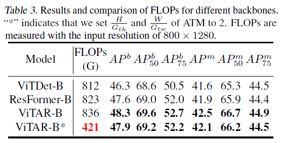

# **ViTAR: Vision Transformer with Any Resolution**
*Authors: Qihang Fan, Quanzeng You, Xiaotian Han, Yongfei Liu, Yunzhe Tao, Huaibo Huang, Ran He, Hongxia Yang*

## Vision Transformers (ViTs)

Vision Transformers (ViT) has recently emerged as a competitive alternative to Convolutional Neural Networks (CNNs) that are currently state-of-the-art in different image recognition computer vision tasks.

   

Vision Transformers (ViT) is an architecture that utilizes self-attention mechanisms to process images. The Vision Transformer Architecture consists of a series of transformer blocks. Each transformer block consists of two sub-layers: a multi-head self-attention layer and a feed-forward layer.

The self-attention layer calculates attention weights for each pixel in the image based on its relationship with all other pixels, while the feed-forward layer applies a non-linear transformation to the output of the self-attention layer. The multi-head attention extends this mechanism by allowing the model to attend to different parts of the input sequence simultaneously.

ViT consists of the following steps.
  1. Split an image into patches (fixed sizes)   
  2. Flatten the image patches 
  3. Create lower-dimensional linear embeddings from these flattened image patches   
  4. Include positional embeddings   
  5. Feed the sequence as an input to a state-of-the-art transformer encoder   
  6. Pre-train the ViT model with image labels, which is then fully supervised on a big dataset.
  7. Fine-tune the downstream dataset for image classification 

The transformer's encoder has a structure in which L transformer blocks sequentially pass through the Feed Forward, which consists of the Normalization Layer, Multi-head Attention, Normalization Layer, and MLP, as shown on the right of Figure 1.

## Challenge: Multi-Resolution ViT Modeling
 Shortcoming of ViT is revealed when receiving multi-resolution images as input. There are limits to its application in actual use environments because ViT cannot process images of various resolutions well.
 
 The most common method used to address this problem is to apply interpolation to positional encoding before feeding it into the ViT. This approach allows for some compensation of positional information even when the input resolution changes. However, this method has shown significant performance degradation in image classification tasks.
 
 Recently, ResFormer proposed adding depth-wise convolution to the existing positional encoding method when performing global-local positional embedding, enabling it to work well even with unseen resolutions. (Chu et al., 2023; Tian et al., 2023).

   

 However, ResFormer has three drawbacks.
 - Shows high performance only in a relatively small range of resolutions (Degradation significantly when resolution is greater than 892)
 - It cannot be used with self-supervised learning methods like masked auto-encoding (MAE).
 - Computation cost increases as input resolution increases, which has a negative impact on the training and inference process.

## ViTAR: Vision Transformer with Any Resolution
In this section, we introduces two key innovations to address this issue. Firstly, we propose a novel module for dynamic resolution adjustment, designed with a single Transformer block, specifically to achieve highly efficient incremental token integration. Secondly, we introduce fuzzy positional encoding in the Vision Transformer to provide consistent positional awareness across multiple resolutions, thereby preventing overfitting to any single training resolution.

   

### 1. Adaptive Token Merger (ATM Module)
 The ATM Module separates input tokens in the form of a grid of $G_h \times G_w$. When the size of all tokens is $H \times W$, all tokens are separated in grid form to have tokens of $G_{th}\times G_{tW}$ size. Each Grid is processed through a special operation called Grid Attention. Grid Attention is carried out only between tokens within the Grid. Average Pooling of all Tokens is performed as a Query, and Attention operation is performed by setting each Token as Key and Value. When this is performed for the entire Grid, it is reduced to $G_h \times G_w$, which is equal to the number of Grids. Afterwards, it passes through the FeedForward network and repeats. Through this iterative process, even when the resolution of the image is large, the number of tokens can be effectively reduced, and through a sufficient process, this size can be reduced to the size of the grid of 1. This has the advantage of being computationally efficient because when performing the subsequent MHSA calculation, a token of the same size is always input as input, regardless of resolution.

   

In our opinion, Grid Attention appears to add an inductive bias similar to Convolution. It appears that Tokens in adjacent locations in the actual image should be contained within the same Grid. The order of grid patching may have an effect.

### 2. Fuzzy Positional Encoding (FPE)
 Existing ViT Models generally use learnable positional encoding or sin-cos positional encoding. However, they do not have the ability to handle various input resolutions because these methods are sensitive to input resolution. In response to this, ResFormer attempted to solve this problem through convolution-based positional embedding.

 However, convolution-based positional embedding is not suitable for use in self-supervised learning such as masked auto-encoding (MAE). This is because the method can extract and utilize the complete spatial feature only if it has all adjacent patches, but in the case of MAE, some of the image patches are masked. This makes it difficult for the model to conduct large-scale learning.

 Fuzzy Positional Encoding(FPE) differs from the previously mentioned methods. It enhances the model's resolution robustness without introducing specific spatial structures like convolutions. Therefore, it can be applied to self-supervised learning frameworks. This property enables ViTAR to be applied to large-scale, unlabeled training sets for training, aiming to obtain a more powerful vision foundation model.

   

 Initially, the learnable positional embedding is randomly initialized and used as the model's positional embedding. At this time, FPE provides only fuzzy positional information and experiences changes within a certain range. Specifically, assuming that the exact coordinates of the target token are (i, j), the fuzzy positional information is (i + s1, j + s2). s1 and s2 satisfy -0.5 ≤ s1, s2 ≤ 0.5 and follows uniform distribution.

 During training, randomly generated coordinate offsets are added to the reference coordinates during the training process, and grid samples for learnable location embeddings are performed based on the newly generated coordinates to generate fuzzy location encoding.

 In case of inference, precise positional encoding is used instead of FPE. When there is a change in input resolution, interpolation is performed on learnable positional embedding. This has strong positional resilience because it was somehow seen and used in the FPE used in the training phase.
 

## Experiments

   

### Result of Image Classification Task

   

### Result of Object Detection Task

   

### Effect of Adaptive Token Merger (ATM) Module

   

### Effect of Fuzzy Positional Encoding (FPE)

   

